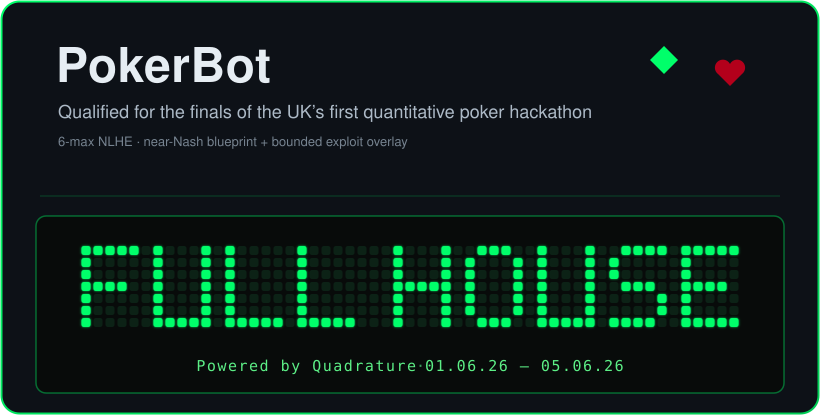
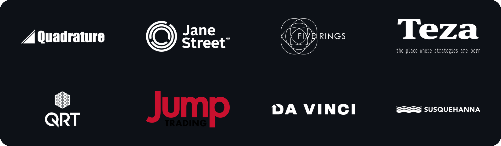
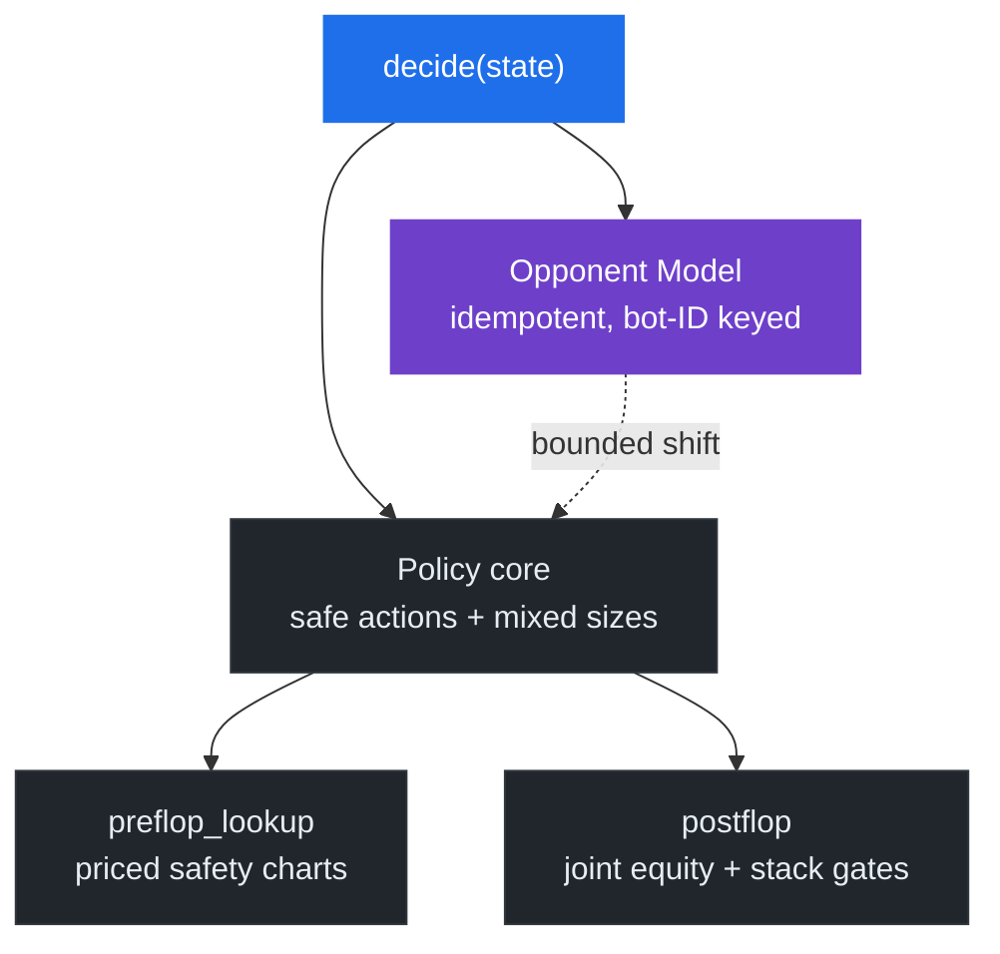
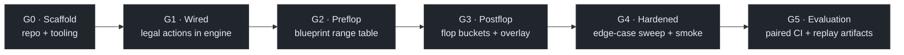

<div align="center">



Built for the **[Full House Hackathon 2026](https://fullhousehackathon.com/)** — the UK's first quantitative poker bot hackathon · £4,000 prize pool

**Hackathon sponsors** — lead sponsor **[Quadrature Capital](https://www.quadrature.ai/)**



<sub>Logos are trademarks of their respective owners, shown for hackathon attribution.</sub>

[](https://github.com/ZealousEar/PokerBot/actions/workflows/ci.yml)


</div>

> [!NOTE]
> **Branches.** This branch (`main`) is the **post-finals patched** build, maintained after the
> competition. The exact, unmodified finals artifact, including the original `v_final.zip`, lives
> on the [`finals-as-submitted`](../../tree/finals-as-submitted) branch.

## At a glance

| | |
|---|---|
| **What** | 6-max no-limit hold'em bot, conservative safety charts + trained mixed sizing |
| **Constraints** | 2 s / decide · 0.5 CPU · 768 MB · no network · pinned libs |
| **Methods** | Priced preflop replay · offline abstract CFR lookup · action-conditioned multiway equity · identity-stable opponent model |
| **Result** | Qualified for the finals (Fullhouse Hackathon 2026) — see [Results](#results) |
| **Verify** | `python tools/import_audit.py && pytest -q` |

---

## Overview

A poker bot for 6-max no-limit hold'em that runs inside a locked-down 2-second / 0.5-CPU sandbox. The maintained build combines conservative chart and commitment gates with a compact offline-trained mixed sizing policy, action-conditioned joint multiway equity, and an idempotent opponent model keyed by stable bot identity.

Built for the first [**Fullhouse Hackathon 2026**](https://fullhousehackathon.com/) (lead sponsor [Quadrature Capital](https://www.quadrature.ai/); £4,000+ prize pool). It runs in two regimes that reward opposite styles:

| When           | Stage                       | Format                                                                                                            |
| -------------- | --------------------------- | ---------------------------------------------------------------------------------------------------------------- |
| **2026-06-01** | Qualifier (Swiss)           | 400-hand 6-max matches; ranked by cumulative chip delta; top 64 advance                                           |
| **2026-06-05** | Finals (Swiss / cumulative) | Phase 1 "The Bubble": ~40 Swiss-paired 6-max matches, 800 hands each, ranked by cumulative chips; Phase 2: final table |

---

## Results

Qualified for the finals of the Fullhouse Hackathon 2026, the UK's first quantitative poker hackathon.

- **Qualifiers** — two Swiss rounds ranked by cumulative chip delta. Finished in the top 64 and advanced to the finals.
- **Finals** — a fresh Swiss/cumulative competition among the 64 qualifiers (standings reset to equal footing). Finished in the top 40.

---

## Strategy

To cover both regimes, the maintained bot uses four cooperating components:

- **Safety envelope** (`src/preflop_lookup.py` + `src/postflop.py`) — reconstructs normalized betting state, prices calls by effective stack and pot odds, and prevents a coarse model from widening chart folds or bypassing postflop commitment gates.
- **Mixed lookup** (`src/blueprint_policy.py` + `data/blueprint_policy_v1.json`) — 1,170 average-strategy rows trained for 1,200 deterministic vanilla-CFR iterations per public context. It mixes permitted preflop and postflop sizes. The solved game is explicitly small: one representative responder, five ordinal strength buckets, and one fold/call response after aggression; it is not a six-player NLHE equilibrium.
- **Overlay** (`src/opponent_model.py`) — consumes each cumulative hand snapshot incrementally, keys profiles by `bot_id`, shrinks estimates toward priors, and bounds every shift. The public tree intentionally ships no `field_priors.npz`, so exploit shifts fail neutral until a validated prior table is supplied.
- **Multiway layer** (`src/equity.py` + `src/commitment.py`) — samples all active opponent holdings jointly without card collisions, conditions ranges on current-street action, and prices effective stacks, SPR, short calls, and publicly reconstructable side pots.
- **Safety metric — exploitability** — Local Best-Response over a fixed 20-spot suite (Lisý & Bowling 2017). The ≤ 100 mbb/g preflop / ≤ 200 mbb/g aggregate caps are **intended targets measured on the private engine harness**; they are not reproduced in this public repo.

---

## Architecture



---

## Game-Theoretic Frame

| Regime                      | Field        | Bias                              | Why                                                          |
| --------------------------- | ------------ | --------------------------------- | ------------------------------------------------------------ |
| Qualifier (Swiss)           | Mostly weak  | Bounded exploit when evidence is valid | Extract chips without trusting cold/noisy profiles        |
| Finals (Swiss / cumulative) | Strong field | Conservative floor + small deviations | Shrinkage and hard gates cap adaptation risk              |

We replace Libratus-style real-time subgame solving (compute-prohibitive at 0.5 CPU / 2 s) with a frequency-based overlay whose deviation magnitude is bounded.

**Dropped, with reasons:**
- Real-time subgame solving (Libratus 2017) — compute budget
- Deep CFR (Brown 2019) — no PyTorch / TF in the allowed library set
- Nested endgame solving — same compute reasons

---

## Known limitations

- The trained lookup is a collection of small one-decision games, not a coherent solved six-max game. Its output controls sizing only inside the maintained action and commitment gates.
- The public build collects clean opponent statistics but ships without the private `field_priors.npz`; its exploit overlay therefore remains neutral by default.
- The engine exposes current-street contributions, not lifetime per-hand contributions. Side-pot eligibility is exact for the current street and conservative for layers created on earlier streets.
- The [over-fold post-mortem](docs/results/overfold-postmortem.md) describes an earlier maintained revision. Its decision-frequency figures are historical, not an EV claim for this candidate.
- The paired harness is now runnable, but no full 400/800-hand, multi-seed promotion result is committed here. Do not infer an EV improvement from unit tests or tiny smoke runs.

---

## Repository Layout

```
PokerBot/
├── src/                          strategy modules
│   ├── bot.py                    decide() entry — legalizes actions, timeout fallback
│   ├── blueprint_policy.py       validated mixed-policy artifact loader
│   ├── preflop_lookup.py         priced preflop action safety charts
│   ├── ranges.py                 6-max range representation
│   ├── postflop.py               action-conditioned multiway postflop play
│   ├── commitment.py             stack-off / commitment gating
│   ├── hand_features.py          board-texture + hand classifiers
│   ├── equity.py                 exact/adaptive eval7 multiway equity
│   ├── opponent_model.py         idempotent bot-ID frequency model
│   ├── sizing.py                 discrete bet-sizing tree
│   └── timeout_guard.py          2 s budget enforcement
├── tools/                        benchmark · package · import-audit · self-play
├── tests/                        edge-case + integration suites
├── data/                         trained mixed-policy JSON + integrity digest
├── docs/                         tournament spec · API cheatsheet · corpus index
├── ext/fullhouse-engine/         official engine clone (separate, gitignored)
├── submissions/                  finals submission artifact — v_final.zip
├── LICENSE                       MIT
├── requirements.txt              pinned dependencies
└── README.md                     this file
```

---

## Setup

```bash
# eval7 needs Cython<3 + wheel and --no-build-isolation
pip install "Cython<3" wheel
pip install --no-build-isolation eval7==0.1.7
pip install -r requirements.txt
```

> **Python 3.10 only.** `eval7==0.1.7` bundles pre-generated C bindings that target the pre-3.11 `longintrepr.h` layout.

---

## Build & Verify

These run in a clean clone, with no engine required:

| Step               | Command                                                                                       |
| ------------------ | --------------------------------------------------------------------------------------------- |
| Rebuild blueprint  | `python tools/train_blueprint.py --iterations 1200 --output data/blueprint_policy_v1.json`       |
| Import audit       | `python tools/import_audit.py`                                                                 |
| Full test suite    | `pytest -q`                                                                                     |
| Build submission   | `python tools/package.py --output submissions/bot.zip --strict`                                 |

**Engine-backed steps** (require the official engine cloned into `ext/fullhouse-engine/`, a separate gitignored checkout containing the sandbox, validator, and local match driver):

| Step               | Command                                                                                                                                                         |
| ------------------ | --------------------------------------------------------------------------------------------------------------------------------------------------------------- |
| Self-play          | `python tools/self_play.py --opponent template --candidate submissions/bot.zip --hands 400 --seed-count 10`                                                   |
| Paired benchmark   | `python tools/benchmark.py --all-templates --candidate submissions/bot.zip --baseline submissions/v_final.zip --hands 800 --paired-seed-base 42`                  |
| Qualifier analysis | `python tools/qualifier_replay.py --history /path/to/history.json --hero-id BOT_ID`                                                                                 |
| Engine validator   | `python ext/fullhouse-engine/sandbox/validator.py submissions/bot.zip`                                                                                             |
| Sandbox smoke run  | `python tools/smoke_run.py --zip submissions/bot.zip --hands 200`                                                                                                  |

Successful evaluation runs persist a manifest, append-only raw engine results,
and a summary with seed-clustered bootstrap confidence intervals. Official raw
histories can be analyzed directly; counterfactual decision replay additionally
requires an instrumented history that captured each action-request state.

---

## Reproducibility & Provenance

Historical bb/100 figures, the LBR exploitability caps, and the old variance
estimate came from a private harness and are **not** reproduced here. The
maintained tree now contains an executable official-engine driver, but not the
expensive promotion-run outputs. [`PROVENANCE.md`](PROVENANCE.md) distinguishes
the implementation, smoke checks, historical numbers, and unrun gates.

What *is* reproducible in a clean clone, engine-free:

- [`notebooks/decision_walkthrough.ipynb`](notebooks/decision_walkthrough.ipynb) — a pre-executed end-to-end `decide()` walkthrough
- `python tools/plot_preflop_heatmap.py` — the shipped RFI ranges as 13×13 grids
- `python tools/overfold_probe.py` — postflop fold/call/raise frequencies (see [`docs/results/overfold-postmortem.md`](docs/results/overfold-postmortem.md))
- `python tools/train_blueprint.py --iterations 1200` — deterministic abstract CFR artifact
- `pytest -q` — betting replay, overlay idempotence, mixed-policy liveness, multiway equity, stack math, tooling, and edge contracts

With the separate official engine checkout, paired six-max evaluation and
qualifier-history analysis are also reproducible. The old private numeric
results remain unverified because their original raw runs are not committed.

The committed finals artifact's integrity is pinned — verify with
`( cd submissions && shasum -a 256 -c v_final.zip.sha256 )`.

---

## Sandbox Invariants

These are hard constraints, taken from `ext/fullhouse-engine/sandbox/{validator.py,Dockerfile,runner.py}`:

- **Runtime:** Python 3.10
- **Pinned libraries:** `eval7==0.1.7`, `numpy==1.26.4`, `scipy==1.13.0`, `treys==0.1.8`, `scikit-learn==1.5.2`
- **Container:** `--network none --memory 768m --cpus 0.5 --read-only --no-new-privileges --user 1000:1000`
- **Budget:** 2 s per `decide()`; one warmup call before hand 1 with a 30 s budget for blueprint load
- **Submission size:** `bot.py` ≤ 5 MB, `data/` ≤ 200 MB, total ≤ 250 MB
- **Layout:** `bot.py` at archive root re-exports `decide` from `src/bot.py`; no other `.py` at root, no `.py` inside `data/`, no symlinks, no path traversal

### Valid actions

```python
{"action": "fold"}
{"action": "check"}                     # only when can_check is True
{"action": "call"}
{"action": "raise", "amount": N}        # N is the TOTAL chips, not the increment
{"action": "all_in"}                    # distinct from raise-to-stack
```

Invalid actions default to fold; the runner emits `{"action": "fold", "error": ...}` on exception or timeout.

---

## Development Gates

We built the bot in verified stages, closing each only after its checks passed:



Gates G1–G5 now have public, executable plumbing and regression coverage. This
does not certify a promotion: a full tournament-length paired run and the
private LBR exploitability check still have to clear their thresholds before a
new archive should replace the frozen finals artifact.

---

## Corpus

We anchor each architectural decision to academic work indexed in [`docs/corpus-index.md`](docs/corpus-index.md):

<details>
<summary><b>Corpus</b> — academic anchors for each design lever</summary>

| Note                                 | Lever                                  |
| ------------------------------------ | -------------------------------------- |
| CFR (Zinkevich 2007)                 | Offline blueprint solver mechanics     |
| MCCFR (Lanctot 2009)                 | External-sampling variance reduction   |
| Cepheus (Bowling 2015)               | State abstraction — buckets and bins   |
| Libratus (Brown & Sandholm 2017)     | Subgame solving (referenced, dropped)  |
| LBR (Lisý & Bowling 2017)            | Exploitability audit as safety metric  |
| Pluribus (Brown & Sandholm 2019)     | Discrete sizing tree; 6-max blueprint  |

</details>

Each implementation names its source at the call site.

---

<div align="center">

*Released under the [MIT License](LICENSE).*

</div>
