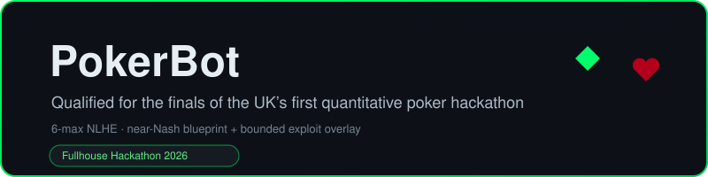
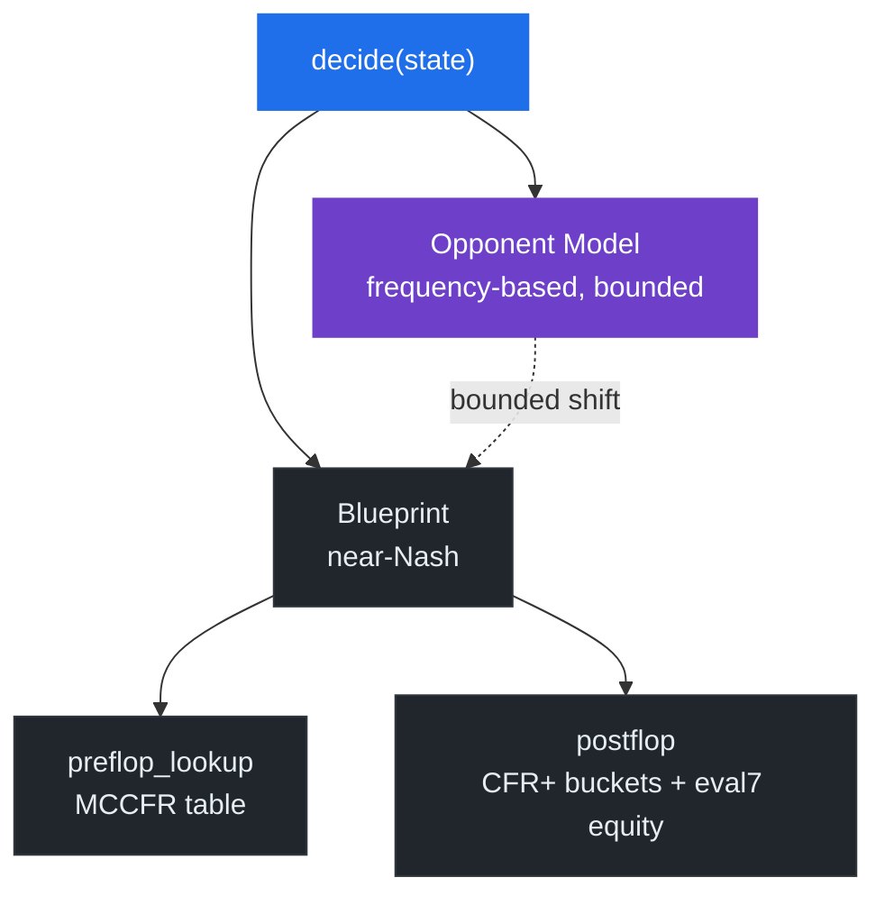
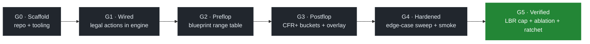

<div align="center">




</div>

> [!NOTE]
> **Branches.** This branch (`main`) is the **post-finals patched** build, maintained after the
> competition. The exact, unmodified finals artifact, including the original `v_final.zip`, lives
> on the [`finals-as-submitted`](../../tree/finals-as-submitted) branch.

## At a glance

| | |
|---|---|
| **What** | 6-max no-limit hold'em bot, near-Nash blueprint + bounded exploit overlay |
| **Constraints** | 2 s / decide · 0.5 CPU · 768 MB · no network · pinned libs |
| **Methods** | MCCFR preflop · CFR+ flop buckets · LBR exploitability cap |
| **Result** | Qualified for the finals (Fullhouse Hackathon 2026) — see [Results](#results) |
| **Verify** | `python tools/import_audit.py && pytest tests/edge_cases` |

---

## Overview

A poker bot for 6-max no-limit hold'em that runs inside a locked-down 2-second / 0.5-CPU sandbox. It pairs a solver-trained near-Nash core with a bounded, opponent-adaptive overlay that punishes weak fields while staying hard to counter-exploit.

Built for the first [**Fullhouse Hackathon 2026**](https://fullhousehackathon.com/) (lead sponsor [Quadrature Capital](https://www.quadrature.ai/); £4,000+ prize pool). It runs in two regimes that reward opposite styles:

| When           | Stage                       | Format                                                                                                            |
| -------------- | --------------------------- | ---------------------------------------------------------------------------------------------------------------- |
| **2026-06-01** | Qualifier (Swiss)           | 400-hand 6-max matches; ranked by cumulative chip delta; top 64 advance                                           |
| **2026-06-05** | Finals (Swiss / cumulative) | Phase 1 "The Bubble": ~40 Swiss-paired 6-max matches, 800 hands each, ranked by cumulative chips; Phase 2: final table |

---

## Results

Qualified for the finals of the Fullhouse Hackathon 2026, the UK's first quantitative poker hackathon.

- **Qualifiers** — two Swiss rounds ranked by cumulative chip delta. Finished in the top 64 and advanced to the finals.
- **Finals** — a fresh Swiss/cumulative competition among the 64 qualifiers (standings reset to equal footing). Finished in the top 40.

---

## Strategy

To cover both regimes, the bot runs two layers:

- **Blueprint** (`src/preflop_lookup.py` + `src/postflop.py`) — approximates Nash over an abstracted game: external-sampling MCCFR for preflop and CFR+ over flop buckets for postflop. This is the floor.
- **Overlay** (`src/opponent_model.py`) — deviates from the blueprint toward best-response against the inferred opponent type; magnitude is bounded so a worst-case counter-exploit costs less than the expected gain.
- **Leverage point — abstraction** — a discrete sizing tree `{1/3 pot, 2/3 pot, pot, 2× pot, all_in}` (Pluribus 2019) and flop bucketing capped at 200 buckets × 50 hand-strength bins (Cepheus 2015).
- **Safety metric — exploitability** — Local Best-Response over a fixed 20-spot suite (Lisý & Bowling 2017), capped at ≤ 100 mbb/g preflop and ≤ 200 mbb/g aggregate.

---

## Architecture



---

## Game-Theoretic Frame

| Regime                      | Field        | Bias                              | Why                                                          |
| --------------------------- | ------------ | --------------------------------- | ------------------------------------------------------------ |
| Qualifier (Swiss)           | Mostly weak  | Max exploit                       | Overlay dominates — chip extraction wins                     |
| Finals (Swiss / cumulative) | Strong field | Near-Nash floor + bounded overlay | Cumulative extraction; shrinkage penalizes variance, so cap the downside |

We replace Libratus-style real-time subgame solving (compute-prohibitive at 0.5 CPU / 2 s) with a frequency-based overlay whose deviation magnitude is bounded.

**Dropped, with reasons:**
- Real-time subgame solving (Libratus 2017) — compute budget
- Deep CFR (Brown 2019) — no PyTorch / TF in the allowed library set
- Nested endgame solving — same compute reasons

---

## Known limitations

The bounded overlay above is a deliberate trade-off, and the shipped build sits on the cautious end of it. It plays a tight, polarized line and folds rather than bluff-catching thin. After the competition we measured exactly that: against an opponent that applies sustained multi-street pressure and bet-folds to resistance, the fold-leaning profile surrenders some pots it could defend. The effect was small but measurable. It did not produce a net loss in the exploiter probes we have run so far. Widening the calling range is the natural next revision. Because it changes the strategy shape, shipping it would mean re-running the full verification surface: exploitability, paired benchmarks, and mechanism-matched counter-exploit probes. We deferred that to a proper cycle rather than hot-patching a frozen submission.

---

## Repository Layout

```
PokerBot/
├── src/                          strategy modules
│   ├── bot.py                    decide() entry — legalizes actions, timeout fallback
│   ├── preflop_lookup.py         offline-trained preflop range
│   ├── ranges.py                 6-max range representation
│   ├── postflop.py               flop bucketing + turn/river play
│   ├── commitment.py             stack-off / commitment gating
│   ├── hand_features.py          board-texture + hand classifiers
│   ├── equity.py                 eval7-backed Monte Carlo equity
│   ├── opponent_model.py         frequency-based exploit overlay
│   ├── sizing.py                 discrete bet-sizing tree
│   └── timeout_guard.py          2 s budget enforcement
├── tools/                        benchmark · package · import-audit · self-play
├── tests/                        edge-case + integration suites
├── data/                         *.npz blueprints (gitignored, regen via tools/)
├── docs/                         tournament spec · API cheatsheet · corpus index
├── ext/fullhouse-engine/         official engine clone (separate, gitignored)
├── submissions/                  finals submission artifact — v_final.zip
├── LICENSE                       MIT
├── requirements.txt              pinned dependencies
└── README.md                     this file
```

---

## Setup

```bash
# eval7 needs Cython<3 and --no-build-isolation
pip install "Cython<3"
pip install --no-build-isolation eval7==0.1.7
pip install -r requirements.txt
```

> **Python 3.10 only.** `eval7==0.1.7` bundles pre-generated C bindings that target the pre-3.11 `longintrepr.h` layout.

---

## Build & Verify

These run in a clean clone, with no engine required:

| Step             | Command                                                           |
| ---------------- | ---------------------------------------------------------------- |
| Import audit     | `python tools/import_audit.py`                                   |
| Edge cases       | `pytest tests/edge_cases`                                        |
| Build submission | `python tools/package.py --output submissions/bot.zip --strict` |

**Engine-backed steps** (require the official engine cloned into `ext/fullhouse-engine/`, a separate gitignored checkout containing the sandbox, validator, and local match driver):

| Step              | Command                                                                         |
| ----------------- | ------------------------------------------------------------------------------- |
| Self-play         | `python tools/self_play.py --opponent <name> --hands <N>`                       |
| Benchmark         | `python tools/benchmark.py --all-templates --hands 10000 --paired-seed-base 42` |
| Engine validator  | `python ext/fullhouse-engine/sandbox/validator.py submissions/bot.zip`          |
| Sandbox smoke run | `python tools/smoke_run.py --zip submissions/bot.zip --hands 200`               |

---

## Sandbox Invariants

These are hard constraints, taken from `ext/fullhouse-engine/sandbox/{validator.py,Dockerfile,runner.py}`:

- **Runtime:** Python 3.10
- **Pinned libraries:** `eval7==0.1.7`, `numpy==1.26.4`, `scipy==1.13.0`, `treys==0.1.8`, `scikit-learn==1.5.2`
- **Container:** `--network none --memory 768m --cpus 0.5 --read-only --no-new-privileges --user 1000:1000`
- **Budget:** 2 s per `decide()`; one warmup call before hand 1 with a 30 s budget for blueprint load
- **Submission size:** `bot.py` ≤ 5 MB, `data/` ≤ 200 MB, total ≤ 250 MB
- **Layout:** `bot.py` at archive root re-exports `decide` from `src/bot.py`; no other `.py` at root, no `.py` inside `data/`, no symlinks, no path traversal

### Valid actions

```python
{"action": "fold"}
{"action": "check"}                     # only when can_check is True
{"action": "call"}
{"action": "raise", "amount": N}        # N is the TOTAL chips, not the increment
{"action": "all_in"}                    # distinct from raise-to-stack
```

Invalid actions default to fold; the runner emits `{"action": "fold", "error": ...}` on exception or timeout.

---

## Development Gates

We built the bot in verified stages, closing each only after its checks passed:



Each gate cleared the same numeric checks before the next one started: an import audit, an edge-case sweep, a benchmark, and an exploitability (LBR) check.

---

## Corpus

We anchor each architectural decision to academic work indexed in [`docs/corpus-index.md`](docs/corpus-index.md):

<details>
<summary><b>Corpus</b> — academic anchors for each design lever</summary>

| Note                                 | Lever                                  |
| ------------------------------------ | -------------------------------------- |
| CFR (Zinkevich 2007)                 | Offline blueprint solver mechanics     |
| MCCFR (Lanctot 2009)                 | External-sampling variance reduction   |
| Cepheus (Bowling 2015)               | State abstraction — buckets and bins   |
| Libratus (Brown & Sandholm 2017)     | Subgame solving (referenced, dropped)  |
| LBR (Lisý & Bowling 2017)            | Exploitability audit as safety metric  |
| Pluribus (Brown & Sandholm 2019)     | Discrete sizing tree; 6-max blueprint  |

</details>

Each implementation names its source at the call site.

---

## Acknowledgements

Built for the [Fullhouse Hackathon 2026](https://fullhousehackathon.com/), the UK's first
quantitative poker bot hackathon (£4,000 prize pool). Lead sponsor
[Quadrature Capital](https://www.quadrature.ai/), with Jane Street, Five Rings, Teza
Technologies, QRT, Jump Trading, Da Vinci, and Susquehanna.

---

<div align="center">

*Released under the [MIT License](LICENSE).*

</div>
