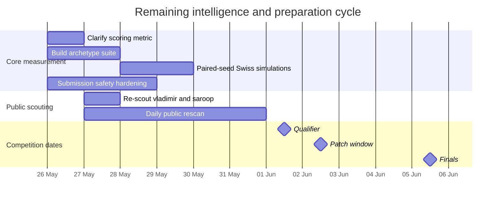

# Competitive Intelligence Review for Finals Qualification

## Executive summary

The Codex memo is **directionally useful but not sufficient on its own** for deciding how to maximise your chance of qualifying for the finals. Its strongest contribution is structural: it correctly identifies that the public field already contains **real, functioning bots outside the obvious stargazer list**, and that “beating the bundled reference bots” is no longer a meaningful acceptance bar. Its weakest contribution is quantitative: the memo’s competitor rankings lean heavily on **small local smoke tests** run over just **five 300-hand seeds** against the bundled reference table, and the memo itself describes those runs as directional only rather than tournament-grade evidence. fileciteturn0file0

Under the public competition format, qualification appears to be **score-based rather than presentation-led**. The organiser site says the top 64 qualify **by chip EV**, while the public repo README says ranking is by **cumulative chip delta** after **Swiss-style 400-hand six-bot matches**, with a **patch window on 2 June** and **finals on 5 June**. The organiser site also frames the event as “No luck. No teams. No slides. Just code.” That means **technical performance, reliability, legality, and variance control dominate qualification probability**, while presentation and judge preference matter little unless there is an unpublished discretionary element. citeturn52view0turn53view0turn54view2turn54view3

At least one competitor assessment in the memo is already **stale**. The memo treated `vladimirfilip` as a low threat unless privately fixed, but the public history for `bots/vlad/bot.py` now shows a **25 May 2026** “(WIP) Deep CFR for GTO play” commit, and the current public `bots/vlad` tree includes `deep_cfr` directories, a GTO-model loader, and a Monte Carlo fallback. That does **not** prove a strong submission-ready bot, but it does mean the memo’s current threat floor for that repo is too low. citeturn33view0turn37view0turn47view2

My overall judgement is that the memo provides **actionable insight for benchmark design, threat modelling, and tactical hardening**, but **not enough validated evidence** to support precise competitor ranking or a precise finals-qualification probability estimate. The highest-return response is to **reweight the memo toward structural signals** and away from smoke-test averages, then immediately benchmark your own bot against public-style archetypes under the official qualifier shape. fileciteturn0file0 citeturn54view2turn54view3

## Qualification mechanics and what matters

The public format implies a very specific optimisation problem. The organiser site advertises **400+ participants** and a **top-64** qualification cut, while the public README describes a **Swiss-system** online qualifier with **400 hands per match**, **6-bot tables**, pairing by similar standing, and **three Swiss rounds**. That means your qualification run is only on the order of **1,200 hands** before the cutoff, which is long enough that edge matters, but short enough that crashes, timeouts, mis-sized variance, or one catastrophic round can still swing qualification materially. citeturn52view0turn54view2turn54view3

The public rules also make reliability unusually important. The README states a **2-second** action budget, no network during gameplay, no file writes at runtime, and auto-fold on crashes/exceptions. The validator additionally supports zipped submissions with optional `data/` payloads, but expects those payloads to be loaded at **module-import time only**, with gameplay remaining within the same 2-second budget. In other words: every extra layer of cleverness must survive strict operational constraints. citeturn29view0turn44view0turn54view1

Because qualification is score-based, the public evidence points to four dominant levers for finals probability. First, **hard-gate compliance**: validator pass, lawful imports, no banned runtime behaviour, safe fallbacks. Secondly, **repeatable chip accumulation**: not just asymptotic EV, but EV that survives a short Swiss horizon. Thirdly, **variance management**: top-64 from a large field rewards upside, but not the kind of unstable upside that creates repeated bust rounds. Fourthly, **upper-middle-field robustness**: Swiss pairings mean that if you do well early, later rounds get stronger, so performance against the Neel/Dominic/Famadeo archetype cluster matters more than performance against templates alone. citeturn53view0turn54view2turn54view3turn44view0

```mermaid
flowchart LR
    A[Validator legality and import-time data discipline] --> B[Stable 2-second decisions]
    B --> C[Per-hand chip EV with low crash risk]
    C --> D[Per-match chip delta over 400 hands]
    D --> E[Three Swiss rounds against improving pods]
    E --> F[Top 64 cutoff]
    F --> G[Finals competition (format corrected 2026-06-04)]
```

**2026-06-06 reconciliation:** "Finals competition" above replaces stale bracket wording; source of truth for corrected finals format is `AGENTS.md` "Finals FORMAT" + 17:32 consult (`prompt-exports/2026-06-04-173203-plan-optimise-next-90min-finals-bot.md`:9,14).

One public ambiguity matters enough to treat as a priority gap: the organiser site says qualification is by **chip EV**, while the public README says ranking is by **cumulative chip delta**. Those are closely related, but not automatically identical if normalisation, tie-breaks, or aggregation differ. If qualification is effectively cumulative chip delta, the incentive to pursue aggressive skewed lines is higher than under a more normalised chip-EV definition. That ambiguity is small in wording but large in strategic consequence. citeturn52view0turn53view0turn54view2

## Codex intelligence register

The two tables below extract the memo’s substantive claims and separate **structural capability claims** from **performance and interpretation claims**. The effect column is judged against the public qualifier format above: score-based qualification, 400-hand Swiss matches, 2-second decisions, no runtime I/O, and a short qualification horizon. fileciteturn0file0 citeturn53view0turn54view2turn44view0

### Structural capability claims

| Memo item | Independent validation | Confidence | Potential bias | Effect on probability of qualifying |
|---|---|---:|---|---|
| **Stargazer sweep**: 32 public stargazers checked; no strong public competitor bot after excluding `ZealousEar`. | **Partly stale and inherently weak as a negative signal.** The repo now shows **34** stargazers, and the current page includes `ZealousEar` among them. A stargazer sweep is still useful for triage, but many serious competitors will never star the repo. fileciteturn0file0 citeturn50view0 | Low–medium | Selection bias, staleness bias, participation bias | **Small direct effect.** Useful for finding easy signals; poor for ruling out unseen threats. |
| **Fork network is more informative than stargazers.** | **Supported.** The public fork network and public fork repos expose actual bot work in `agrawalneel25`, `Linglingletsgo`, `famadeo`, `vladimirfilip`, and `Littleguygabe`, whereas several stargazer-linked repos are low signal or untouched. fileciteturn0file0 citeturn3view2turn10view3turn25view0turn29view0turn30view1 | High | Public-only visibility bias | **Large.** This is one of the memo’s most actionable insights, because it raises the public field floor. |
| **`agrawalneel25/neel-work`** adds a 257-line `bots/neel/bot.py` using eval7-supported MC equity, preflop tables, pot-odds calls, value bets, and occasional semi-bluffs. | **Supported.** The compare page shows “Add poker bot collaboration tooling” with `bots/neel/bot.py` and a +257-line change, and the raw bot file describes exactly that style. fileciteturn0file0 citeturn3view2turn48view0 | High | Branch-selection bias | **Large negative if ignored.** A compact, legal, well-scoped bot of this class is a realistic qualifier opponent. |
| **`Linglingletsgo/blueprint-exploit-bot`** adds `bots/dominic/bot.py` and `blueprint.json`, with preflop hand classes, thresholds, SPR logic, and opponent-profile overlays. | **Supported.** The commit adds `bots/dominic/bot.py` and `blueprint.json`; the bot loads the JSON, builds an opponent profile, uses `fold_rate`, `aggression`, `spr`, and river-specific thresholds; the blueprint file contains preflop classes and street thresholds. fileciteturn0file0 citeturn10view1turn10view3turn16view0turn16view1turn16view2turn16view3turn20view0 | High | Branch-selection bias | **Large negative if ignored.** This is exactly the kind of legal, deployable lookup-table bot the rules permit. |
| **`famadeo/main`** adds a long `codex_holdem` bot with `model.json`, plus commits for survival heads, public belief, range-conditioned equity, and risk gates. | **Supported in broad outline.** The compare page lists the cited commit subjects; `bot.py` loads `model.json`; `model.json` contains `feature_names`, `heads`, `n_samples`, `runtime_enabled`, `target`, and `version`; later commits explicitly stage `preflop_strategy`, `postflop` scaffolding, range-conditioned equity, and benchmarked risk gates. fileciteturn0file0 citeturn25view0turn24view0turn26view0turn26view1turn26view2turn26view3turn22view0turn23view0turn23view1turn23view2turn23view3 | High on existence; medium on exact live use | Snapshot bias, branch-selection bias | **Moderate to large.** Even if incomplete, this is a serious engineering signal. |
| **Important caveat**: `runtime_enabled` is false in `famadeo`’s model JSON, so much of the model-head machinery may be scaffolded rather than active. | **Supported.** The public `model.json` shows `runtime_enabled: false`. The public bot loader also returns `None` unless `runtime_enabled` is true. fileciteturn0file0 citeturn22view0turn23view2turn23view3 | High | Snapshot bias; could be toggled before submission | **Positive for us in the short term.** It lowers realised threat relative to code volume. |
| **`saroopjagdev/stable-stage18`** exposes a 4,959-line staged bot with opponent classification, anti-punt layers, river variants, and exploit multipliers. | **Not independently revalidated in this session.** The memo provides detailed claims, but I could not retrieve the public compare/file content reliably enough to verify them directly here. fileciteturn0file0 | Low | Tooling-access bias, branch-selection bias | **Medium with wide uncertainty.** Treat as an archetype to defend against, not as a precisely ranked threat. |
| **`vladimirfilip/main`** was a simple Monte Carlo plus equity-based decision bot. | **Only partly current.** The history confirms 13 May and 15 May commits for “basic monte carlo equity algo” and “equity-based decision-making”, but the current public repo now shows a **25 May** “(WIP) Deep CFR for GTO play” commit, `deep_cfr` directories, a GTO-model path, and MC fallback. fileciteturn0file0 citeturn37view0turn33view0turn47view2 | Medium | Strong staleness bias | **Moderate and rising uncertainty.** The memo understated current upside risk. |
| **`Littleguygabe/fullhouse-poker`** contains multiple public bots, but most are incomplete or weak. | **Supported.** The bots folder includes `aof`, `memoryTest`, `mybot`, and `ranger`; raw files show an all-in bot, a memory-test fold bot, a range-loader that still always folds, and a `mybot` whose postflop path is incomplete and crash-defensive. fileciteturn0file0 citeturn31view0turn45view0turn47view1turn47view0turn45view2 | High | Public/private gap | **Small direct threat.** Useful mainly as evidence that many public entrants are unfinished. |
| **No meaningful public solver evidence.** | **Weaker now than in the memo.** The memo’s May 24 conclusion was reasonable as a public-snapshot statement, but it is already less reliable because `vladimirfilip` now publicly exposes Deep CFR artefacts and a GTO loader. That still does not prove a strong active runtime solver, but it removes confidence from the negative claim. fileciteturn0file0 citeturn33view0turn37view0turn47view2 | Low–medium | Staleness bias; public/private gap | **Medium.** The right lesson is uncertainty management, not complacency. |

### Performance and interpretation claims

| Memo item | Independent validation | Confidence | Potential bias | Effect on probability of qualifying |
|---|---|---:|---|---|
| **Benchmark protocol**: five paired seeds, 300 hands per seed, same bundled refs, local dev mode not Docker, directional only. | **Supported by the memo itself**; this is the correct way to read the numbers. Official qualifier matches are 400 hands and the README describes Swiss-format tournament play, so the memo’s local smoke tests are materially less representative than the real qualifier. fileciteturn0file0 citeturn54view2 | High | Small-sample bias, weak-opposition bias, environment bias | **Very large for interpretation.** The benchmark means should not be used as exact ranking estimates. |
| **Neel**: validator PASS and average smoke delta `+16287` over 5×300. | I did **not** independently rerun the validator or reproduce the exact deltas. The public file structure supports the idea that this bot is plausible and benchmark-worthy, but the exact PASS and average figure remain memo-only. fileciteturn0file0 citeturn48view0turn44view0 | Medium on legality; low on average delta | Local-environment bias, weak-opposition bias | **Large if the behavioural class is real; smaller if you trust the exact delta.** The architecture matters more than the reported average. |
| **Dominic**: validator PASS and average smoke delta `+12821` over 5×300. | Same judgement as above: **not rerun here**, but the public bot is clearly real and deployable. The exact average should be treated as low-confidence directional evidence. fileciteturn0file0 citeturn16view0turn16view1turn16view2turn16view3turn20view0turn44view0 | Medium on legality; low on average delta | Small-sample bias, branch bias | **Large behavioural importance.** A threshold-blueprint bot of this type is a serious qualifier benchmark. |
| **Famadeo**: validator PASS and average smoke delta `+8270` over 5×300. | **Not rerun here.** Public evidence supports the existence of a complex bot, but the exact realised performance is especially uncertain because the public model runtime is disabled. fileciteturn0file0 citeturn22view0turn23view2turn24view0turn26view0turn26view1turn26view2turn26view3 | Medium on structure; low on realised average | Runtime-toggle bias, complexity bias | **Moderate.** This raises uncertainty about hidden strength more than it establishes visible strength. |
| **Saroop**: validator PASS and average smoke delta `+4130`, but unstable. | **Memo-only for now.** I could not independently validate the public compare/file in this session, so both the PASS and instability claims should be treated as low-confidence until reproduced. fileciteturn0file0 | Low | Access/tooling bias, environment bias | **Medium.** Best treated as a brittle high-complexity archetype rather than a ranked public bot. |
| **Vladimir**: validator FAIL under the local validator because of `short_stack_all_in_decision`. | **Not reproduced here and likely stale as a threat estimate.** The memo’s failure mode may have been real for the observed version, but the repo moved again on 25 May and current public code is materially richer. fileciteturn0file0 citeturn37view0turn47view2 | Low–medium | Environment bias, staleness bias | **Medium.** You should neither dismiss nor overrate this bot without a fresh check. |
| **Littleguy**: public bots are low threat, with poor or incomplete performance. | **Directionally supported by code.** The public bots are simplistic or incomplete enough that the memo’s low-threat judgement is reasonable. fileciteturn0file0 citeturn45view0turn47view1turn47view0turn45view2 | Medium–high | Public/private gap | **Small.** These bots are more relevant as noise in early Swiss rounds than as upper-cutoff threats. |
| **Threat-level conclusion**: qualifier medium-high, finals medium with high uncertainty. | **Still directionally sound**, but only if interpreted as a public-signal judgement rather than a full-field estimate. The uncertainty term should now be raised, not lowered, because the public snapshot has already changed since 24 May. fileciteturn0file0 citeturn37view0turn50view0 | Medium | Public/private gap, staleness bias | **Large.** The correct operational posture is “serious field, uncertain tail”, not “known ranking”. |

Taken together, the memo is **strongest on public-structure diagnosis** and **weakest on quantitative ranking**. The right operational takeaway is: **public working bots exist, the public field floor is above the bundled references, and your own benchmark suite must now model that floor directly.** fileciteturn0file0

## Competitor map against our team

Because I do not have your bot, logs, or internal benchmark pack in this session, the table below compares competitors against the **preparation standard your team should assume for itself by submission**: validator-safe, import-time data only, reliable 2-second decisions, qualifier-first variance control, and enough strategic depth to beat public range-plus-equity archetypes. Presentation is included because you asked for it, but I weight it **very lightly** for qualification given the public “No slides. Just code.” framing and score-based qualifier description. citeturn53view0turn54view2

| Competitor | Technical performance | Presentation | Novelty | Reliability | Scoring risk | Logistics | What this means for us |
|---|---|---|---|---|---|---|---|
| **Neel** | **Medium-high realised**, compact and practical; visible preflop tables plus eval7-supported MC and pot-odds logic. citeturn3view2turn48view0 | Low relevance for qualifier. citeturn53view0turn54view2 | Low–medium | Likely **high**: small codebase, simple moving parts. citeturn48view0 | Medium: simple thresholds can be exploited, but simple systems also avoid punts. | Low | This is the **minimum serious public archetype** we should expect to meet in upper-middle Swiss pods. We should aim to beat this class comfortably, not narrowly. |
| **Dominic** | **Medium-high realised**, more structured than Neel because the lookup file, opponent profile, SPR logic, and river thresholds all appear live. citeturn16view0turn16view1turn16view2turn16view3turn20view0 | Low relevance for qualifier. citeturn53view0turn54view2 | Medium | Likely **high** if the blueprint is stable. | Medium: threshold bots can overfold or mis-defend if pressure is well targeted. | Medium: JSON payload is operationally straightforward under the public rules. citeturn54view1turn44view0 | This is the **most actionable public threat** class: legal, simple enough to survive, sophisticated enough to punish weak bots. |
| **Famadeo** | **High ceiling, medium current realisation**. The engineering surface is the richest public one, but `runtime_enabled: false` reduces confidence that the visible heads are live. citeturn25view0turn22view0turn23view2 | Low relevance for qualifier. citeturn53view0turn54view2 | High | Medium: complexity raises integration risk. | Medium-high: code volume can hide brittleness or over-conservatism. | Medium-high | We should prepare for the **risk-gated conservative archetype**, but not assume the public branch equals the real submission. |
| **Saroop** | **Unknown ceiling, wide band.** The memo describes a very large staged bot, but I could not independently verify the live public artefact here. fileciteturn0file0 | Low relevance for qualifier. citeturn53view0turn54view2 | Medium-high if the staged design is real | Unknown | High: large staged systems are where variant drift and brittle guards usually live. | High | Model this as a **brittle high-complexity archetype**. Do not spend preparation time on precise ranking until you can validate it. |
| **Vladimir** | **Rising uncertainty.** Earlier public commits match the memo’s simple-MC description, but current public code now includes Deep CFR artefacts, a model loader, and MC fallback. citeturn37view0turn33view0turn47view2 | Low relevance for qualifier. citeturn53view0turn54view2 | High | Medium: fallback logic helps, but any model-path breakage matters. | Medium-high | High: NPZ models plus hybrid logic increase operational burden. | This is the **single biggest public stale-threat problem** in the memo. It needs a fresh rescan before you trust any low-threat label. |
| **Littleguy public bots** | Low. The public bots are incomplete, all-in, fold-only, or unfinished postflop. citeturn31view0turn45view0turn47view0turn47view1turn45view2 | Low relevance for qualifier. citeturn53view0turn54view2 | Low | Low–medium | Low as a direct threat; medium as early-round variance noise | Low | Strategically, these matter only as **noise and donor chips** in early Swiss rounds. They should not shape our main design. |

The most important comparative conclusion is that the **real public cutoff threat is not flashy solver work**; it is the cluster of **boring, robust, legal range-plus-equity bots** that survive the validator, avoid self-destruction, and accumulate chips consistently. That is why the memo is genuinely actionable for qualifier preparation even though it is not fully validated as a ranking exercise. fileciteturn0file0 citeturn48view0turn16view0turn20view0turn54view2

## High-impact gaps and collection plan

The six unknowns below are the ones most likely to move your finals-qualification probability if resolved before submission. They combine **format uncertainty**, **stale competitor state**, and **missing measurement on your own bot**. fileciteturn0file0 citeturn53view0turn54view2turn54view3

| High-impact data gap | Why it matters most | Expected swing if resolved |
|---|---|---|
| **Ranking metric and tie-break definition** | The organiser site says **chip EV**; the public README says **cumulative chip delta**. That affects optimal variance appetite, bluff frequency, and risk-taking near the cutoff. citeturn53view0turn54view2 | **Very high** |
| **Current true state of `vladimirfilip`** | The memo is already stale here; a 25 May Deep CFR commit and current GTO-loader logic materially change the threat floor. citeturn37view0turn33view0turn47view2 | **High** |
| **Independent validation of `saroopjagdev/stable-stage18`** | The memo’s claims are detailed, but unverified here. If that bot is real and stable, the field ceiling is higher; if not, useful prep time should be spent elsewhere. fileciteturn0file0 | **High** |
| **Reproducible qualifier-shaped performance of public archetypes** | Five 300-hand smoke runs against weak refs are not enough. You need paired-seed, 400-hand, Swiss-shaped evidence to know which public archetypes actually threaten the top-64 cutoff. fileciteturn0file0 citeturn54view2 | **Very high** |
| **Your own bot’s EV, variance, and reliability against those archetypes** | This is the most load-bearing missing variable. Without it, all competitor analysis remains external rather than decision-driving. | **Very high** |
| **Field-strength mix and cutoff distribution** | Public GitHub is not the full field. Knowing whether the top-64 bar looks like “beat weak bots consistently” or “survive upper-middle Swiss pods” changes how conservative you should be. citeturn52view0turn54view2 | **High** |

The most efficient way to close those gaps is a tight, public-only intelligence and benchmark programme over the next few days.

| Priority | Action | Method | Timeline | Resources | Expected information gain | Risk and legality |
|---|---|---|---|---|---|---|
| **Immediate** | Clarify the **official scoring metric** | Ask organisers directly, in writing, whether qualifier ranking is by chip EV, cumulative chip delta, or a normalised equivalent; also ask for tie-breaks. | Same day | 1 person, 15–30 minutes | **Very high** | No risk; official clarification is the cleanest route. |
| **Immediate** | Build a **public-archetype benchmark suite** | Implement behavioural lookalikes for the memo’s five recommended archetypes — `range_mc_pot_odds`, `blueprint_threshold_exploit`, `risk_gated_conservative`, `stage_variant_anti_punt`, `monte_carlo_basic` — without copying code. fileciteturn0file0 | 24 hours | 1 engineer | **Very high** | Keep it behavioural, not copy-paste. Public-code licensing and competition fairness both argue for mimicry, not reuse. |
| **Immediate** | Run **paired-seed qualifier-shaped simulations** | Use 400-hand tables and Swiss-style round logic, not one-off smoke matches. Measure mean chip delta, downside tail, timeout/crash rate, and ranking robustness. citeturn54view2turn44view0 | 24–48 hours | 1 engineer + compute workstation | **Very high** | Low risk; this is internal benchmarking. |
| **High** | Re-scout **`vladimirfilip` and `saroopjagdev`** | Do a fresh public scrape of branch heads, commit history, model/data artefacts, and validator plausibility; reclassify only after current-state evidence is collected. citeturn37view0turn33view0turn47view2 | 1 day | 1 researcher | **High** | Public-source only; no auth bypass, no private probing. |
| **High** | Stress-test **your own submission packaging and runtime safety** | Validate zip/data packaging, import-time loads, fallbacks, edge-case decisions, timeout headroom, and exception behaviour under the official validator assumptions. citeturn54view1turn44view0 | 1 day | 1 engineer | **Very high** | Low risk; this is exactly what the public rules require. |
| **Medium** | Estimate the **top-64 cutoff distribution** | Build a simple Monte Carlo field model: weak public bots, reference-level bots, robust range/MC bots, and one uncertain stronger tail. Use it to estimate how costly a single catastrophic round is. | 1 day | 1 analyst | **Medium-high** | Low risk; model uncertainty should be reported clearly. |

The schedule pressure is real. Publicly, the event runs **1–5 June 2026**, with the qualifier on **1 June**, patch window on **2 June**, and finals on **5 June**. citeturn52view0turn54view2turn54view3



## Tactical changes to raise qualifying odds

**Raise the acceptance bar immediately.** The memo’s most actionable point is that the bundled references are too weak to be a serious pass criterion. Your gating standard should become: validator-safe submission, no runtime faults, and positive paired-seed performance against Neel-, Dominic-, and risk-gated-conservative archetypes under qualifier-shaped matches. A bot that only farms `template`, `aggressor`, `mathematician`, and `shark` is still unproven for the top-64 cutoff. fileciteturn0file0 citeturn54view2turn44view0

**Optimise for qualifier consistency before you optimise for finals elegance.** With a short Swiss horizon and top-64 cut, your biggest avoidable losses come from crashes, timing issues, illegal actions, and high-variance anti-punt failures — not from lacking a theoretically pristine solver. That argues for explicit safe fallbacks, conservative stack-off guards, bounded postflop logic, and a strong “do no harm” layer around any higher-ceiling heuristics or model components. citeturn29view0turn44view0turn54view2

**Target public threshold bots with sizing discipline, not gratuitous complexity.** The memo’s likely exploit targets remain sound: fixed-threshold callers tend to overfold when required equity is nudged just above their margins; simple MC bots tend to misprice multiway wet-board realisation; conservative river logic can overfold bluff-catchers to large pressure. Your tactical preparation should therefore include blind-defence and 3-bet-pot pressure lines, multiway/wet-board discounts, and deliberate river sizing tests against threshold defenders. fileciteturn0file0 citeturn16view1turn16view2turn16view3turn48view0

**Use data payloads where they help, but keep runtime dependence modest.** The public rules explicitly support zipped submissions with a `data/` payload, loaded at import time only, with `data/` capped at **200 MB** and total package size at **250 MB**. That makes Dominic-style blueprints or compact preflop/risk tables perfectly viable. What it does **not** support is fragile runtime file access, high-latency model orchestration, or anything that eats into the 2-second decision budget. The best tactical posture is a lookup-heavy but operationally simple bot with a safe runtime fallback. citeturn54view1turn44view0

**De-emphasise presentation and novelty for qualification.** Publicly, this qualifier is about score, not slides, and not a judged demo. A clever narrative or a sophisticated-sounding architecture only matters if it translates into chips within the official runtime constraints. In practical preparation terms, that means spending marginal hours on benchmark coverage, timeout margins, and hand-history analysis — not on trying to appear more solver-like than the public field. citeturn53view0turn54view2

**Prepare the patch-window workflow now, even though qualification comes first.** The README says hand histories from Day 1 become downloadable as JSON and one updated bot can be submitted before finals day. That means the best finals-qualification posture is not just “submit once and hope”; it is “qualify with a robust baseline, then exploit the patch window efficiently”. Concretely, you should already have a parser, leak dashboard, and a short list of patch-safe toggles ready before 1 June. citeturn54view3

The bottom-line judgement is straightforward: **Codex produced a useful public-intelligence memo, but its value comes from revealing the public field floor and the right benchmark classes, not from its raw smoke-test leaderboard.** If you treat it that way — as a map of public archetypes, compliance constraints, and exploitable failure modes — it is actionable and worth using. If you treat it as a precise ranking of who is strongest, it is too thin, too stale in places, and too benchmark-biased to carry that load. fileciteturn0file0